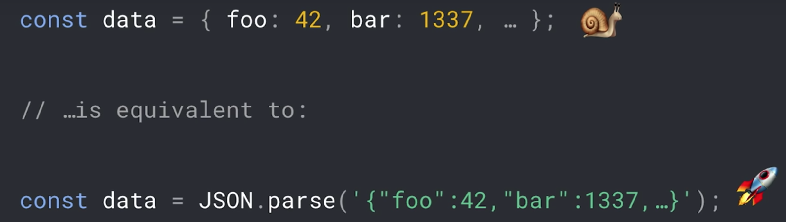

## Works 🎨

  

    <h4>Goofi Mobile</h4>
    

      

        
        
Mobile app for searching good first issues in OSS

        

          <a href="https://github.com/nd-02110114/goofi-mobile/" target="_blank">
            https://github.com/nd-02110114/goofi-mobile
          </a>
        

      

      

        <h5>Skills</h5>
        
TypeScript, React Native (Expo), Apollo, Styled components, GraphQL

      

    

  

  

    <h4>Babel plugin object to json parse</h4>
    

      

        

          <a href="https://github.com/nd-02110114/babel-plugin-object-to-json-parse" target="_blank">
            This plugin
          </a>
          &nbsp;converts object literal to JSON.parse
        

        
      

      

        <h5>Introduction at ChromeDevSummit</h5>
        
 This plugin is inspired by&nbsp;
          <a href="https://v8.dev/blog/cost-of-javascript-2019#json" target="_blank">
            V8 blog
          </a>
        

        
Mathias Bynens introduced this plugin at ChromeDevSummit 2019

      

    

  

